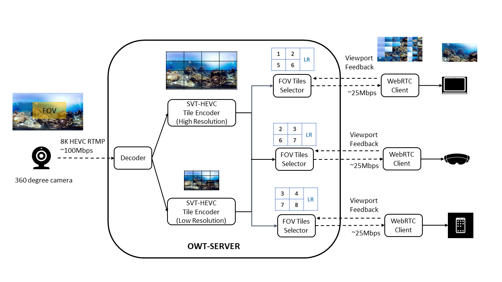

# Introduction

The Immersive Video WebRTC sample provides a low latency end-to-end 360 video streaming service, based on the WebRTC technology and Open WebRTC Toolkit (OWT) media server. It supports 4K and 8K tile based transcoding powered by SVT-HEVC, and bandwidth efficient FoV based adaptive streaming.



# OWT-SERVER

The Open WebRTC Toolkit (OWT) media server for ultra-high resolution immersive video provides a low latency streaming service. The media server supports streaming protocals (RTSP/RTMP) from camera source，or various media formats from local file source. The input video stream is transcoded with SVT-HEVC into two streams, high resolutino tile stream and low resolution tile stream. These two tile streams are merged into single FoV based mix-resolution stream，and streaming out to client by WebRTC.

## System Requirements

### Operating System

The OWT-SERVER is provided as CentOS 7.6 dockerfile in this sample.

### Hardware Tested

| Platform | Server | Client |
|:----:|:----:|:----:|
| CPU SKU | Intel® Xeon® Platinum<br>8280M CPU @ 2.70GHz | Intel® Core™ i7-6770HQ<br>CPU @ 2.60GHz x 8 |
| Memory | 128G | 16G |

### Supported Video Projections

|Type|
|-----|
|Equirectangular (ERP)|

### Supported Resolutions

|Type|Resolution|Tiles|
|-----|-----|-----|
|4K|3840x2048|10x8|
|8K|7680x3840|12x6|

### Supported Input Video Codecs

|Type|
|-----|
|H264|
|HEVC|
|VP8|
|VP9|

## Install docker engine:

(1) Install [docker engine](https://docs.docker.com/install).

(2) Install [docker compose](https://docs.docker.com/compose/install).

## Build docker images:

```bash
cd WebRTC-Sample/owt-server
mkdir build
cd build
cmake ..
make
```

## Start/stop services:

Use the following commands to start or stop services via docker compose:

```bash
cd WebRTC-Sample/owt-server/build

# start 4k service
make start_owt_immersive_4k

# start 8k service
make start_owt_immersive_8k

# stop service
make stop
```

# OWT-LINUX-PLAYER
The OWT-LINIX-PLAYER is an immersive 360 video player on linux, with WebRTC backend. It supports HEVC tile decoding, ERP video rendering, and FoV feedback.

## Operating System

- __Linux* Operating Systems (64-bit):__

  - Ubuntu 18.04 LTS
  - Ubuntu 20.04 LTS

## Build

```bash
cd WebRTC-Sample/owt-linux-player

# build owt linux sdk and dependencies
./build_webrtc_linux_client_sdk.sh

# build player
./build_player.sh
```

## Run

Start OWT-SERVER 4K or 8K immersive service on server side. And run player on client side as below.

### Configure player

```bash
cd WebRTC-Sample/owt-linux-player/player

vi config.xml
```

- "sourceType": 2
    >*2 is WebRTC source type*
- "resolution": 4k
    >*Supported 4k or 8k resolution*
- "server_url": ht<span>tp://</span>**owt-server-ip**:3001

### Start player

```bash
cd WebRTC-Sample/owt-linux-player/player
source ./setupvars.sh
./render
```
- **Press "s" key to start playing**
- Press "arrow" keys to change viewport
- Press "Esc" key to exit
