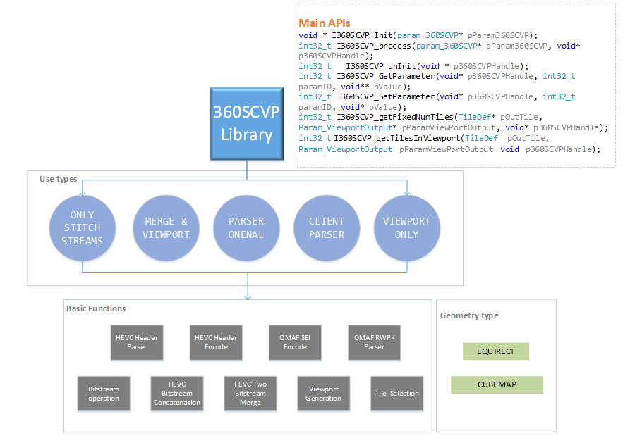
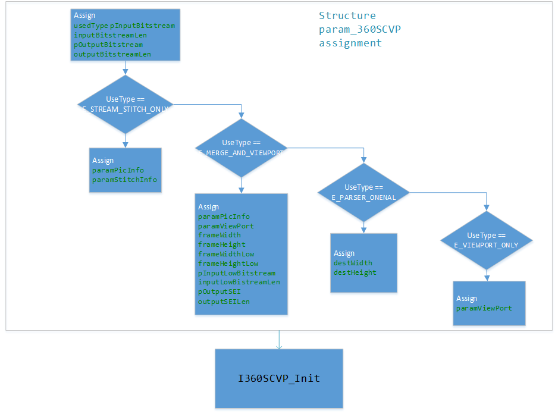

# Immersive Video Delivery 360SCVP (Stream Concatenation and Viewport Processing) Library

## Introduction
360SCVP is a common library, which provides some basic functions for stream and view port. So, the 360SCVP is the abbreviation of stream concatenation and view port about 360 videos.
360SCVP library is used in the server side (encoder and packing) and client side(dashaccess and player) of the OMAF compliance solution. Besides this, the library can be used in the 360 low-latency solution. So, 360SCVP is scalable, which can be easily extend to more functions according to users’ requirements.
For now, both equirect and cubemap geometry type are supported.
The below diagram shows the four use types and the basic functions, which are supported currently. Whether the functions or the use types can be extended in the future.
In the latest version, a fast viewport calculation algorithm is proposed by using a look-up table, which effectively reduced the calculation time and thus optimized the E2E latency.

       

## The main data structures
The below table shows the five key data structures, which are param_360SCVP, param_streamStitchInfo , param_streamStitchInfo , param_ViewPortInfo and param_PicInfo. Besides these data structures, there is a UsageType enum. Currently there are four types supporting: 
- E_STREAM_STITCH_ONLY, when given some clips which must be tile-based (one tile or multi-tiles), the library can concatenate them into one clip.
- E_MERGE_AND_VIEWPORT, when given the view port information and one frame bitstream, the library can calculate the viewport area in the frame and output the corresponding bitstream; additionally, if given two frame bitstreams e.g. one is high resolution and the other is low resolution, the library can calculate the viewport area and merge the corresponding two bitstreams into one bitstream.
- E_PARSER_ONENAL, when given one NAL bitstream (SPS, PPS, SLICE, etc.), the library can parse the bitstream and return some key variables that users are interested in. If give some key variables, the library can generate its corresponding NAL bitstream.
- E_PARSER_FOR_CLIENT, the library can parse some feedback information in client, currently the RWPK parser is supported.
- E_VIEWPORT_ONLY, when getting viewport information from Omaf Dash Access library, it can calculate content coverage of FOV and generate related information of selected tiles.

| **Fields** | **Description** |
| --- | --- |
| param_PicInfo | This is the picture information structure, for example picture width, picture height, tile number in horizontal and vertical. It is input parameter when the use type is E_STREAM_STITCH_ONLY. | 
| param_ViewPortInfo |	  This structure is for the view port parameters, which contain the FOV information, projection type, view port width, view port height. It is input parameter when the use type is E_MERGE_AND_VIEWPORT. |
| param_streamStitchInfo  |   The structure provides the input bitstream clips and some frame level parameters. It is input parameter when the use type is E_STREAM_STITCH_ONLY. For each bitstream clips, there is a structure param_oneStream_info to provide its information. |
| param_oneStream_info |	  The structure provides the horizontal and vertical tile number, tile index, bitstream data buffer and data length in each input bitstream. It is input parameter when the use type is E_STREAM_STITCH_ONLY |
| param_360SCVP 	      |   The structure is the main data structure, which provides all of the input and output parameters used in the library. So, it contains the above four data structures |
| Param_VideoFPStruct 	  |   The structure describes the face property of the input geometry, including tile row/col number, width/height of each face, etc. |
| PluginDef               |   The structure is the plugin definition which provides plugin information. |

## Cubemap support
- The following picture and face index table[1](#refer-anchor) show the coordinates definition for cubemap.

    

| **Face index** | **Face label** | **Notes** |
| --- | --- | --- |
| 0 | PX | Front  face with positive X axis value |
| 1 | NX | Back   face with negative X axis value |
| 2 | PY | Top    face with positive Y axis value |
| 3 | NY | Bottom face with negative Y axis value |
| 4 | PZ | Right  face with positive Z axis value |
| 5 | NZ | Left   face with negative Z axis value |

## Call Sequences
- The following diagram shows how to initialize the library:

    

- After initialization, you can call library as following workflow:

    

## Reference
[1] Yuwen He, Bharath Vishwanath, Xiaoyu Xiu, Yan Ye. AHG8: Algorithm description of InterDigital’s projection format conversion tool (PCT36i0), JVET-D0090, Chengdu, CN, 15–21 October 2016.
