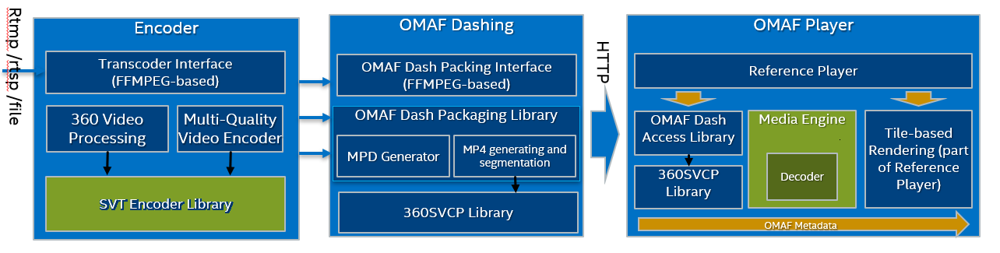

# Immersive Video Delivery Software Architecture

There are two major components in server side to have tile-based 360 Video encoding and OMAF-Compliant packing.
- Tile-based Encoding: SVT-HEVC can support MCTS which is a must feature to support tiled 360 video streaming; it is the encoder library to support the whole solution. Projection/Rotation/rwpk and reletive SEI information should be included in encoded bitstream. 
- OMAF DASH Packing: according to the processing mode, the component can accept multiple streams, and then packing the streams' into tiled-base mp4 segmentations: normal tile video segmentation and extractor segementation. Extractor segmentations creation is decided by input streams' SEI information, and the Packing library will generate special rwpk/srqr information for each extractor segmentation.

As for client side, there are two components in this solution too.
- OMAF Dash Access Library: the library provides basic functions to parse mpd file, selectes extractor track based on current viewport, downloads relative tile segments, parses the extractor and tile segments, and then output a standard HEVC NAL frame with RWPK information for decoding
- Reference OMAF player: the refernce player gets aggregated video bitstream based on OMAF Dash Access library, decodes the bitstream with/without HW acceleration, and then render the picture to sphere/cube mesh based on rwpk of each tile in the frame.

Beside the components in Server/Client, there is a common library which is used to do basic process such as:
- Provide a unify interface to process tile-based HEVC bitstream processing and viewport-based content processing;
- Support HEVC bitstream processing: VPS/SPS/PPS parsing and generating, 360Video-relative SEI generating and parsing, HEVC tile-based bitstream aggregation;
- Support Viewport generation, viewport-based tile selection and extractor selection based on content coverage;

FFMPEG Plugins in this solution provide a quick way for user to try this tiled 360 Video streaming solution using common ffmpeg command line.
