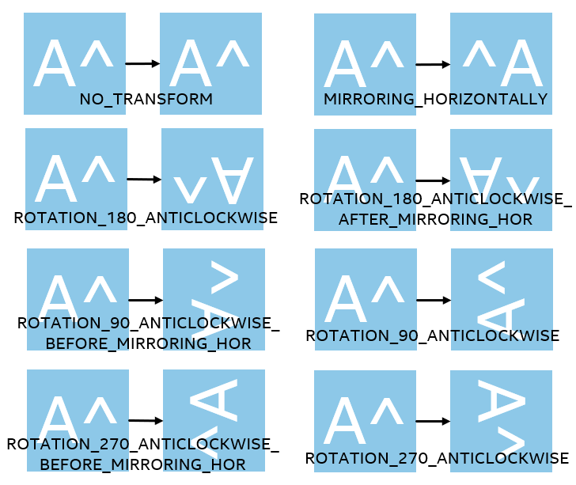

# Immersive Video Delivery Cubemap Transform Type

It is assumed that the scenes that are shot in 360 degree real world are defined as NO_TRANSFORM. And in cubemap projection, the six faces are defined in the following figure.

In particularly, in face NZ bottom/PZ top, the layout that can be stitched continuously with PX front is defined as NO_TRANSFORM.

To figure out how to define transform type of the input cube-map source, we should know that there are total 8 transform types of rotation, which are shown in the following figure.

The transform type is to specify the rotation and mirroring to be applied to the i-th packed region to remap to the i-th projected region. This parameter is required as an input to describe the input cube-map source in server end.
