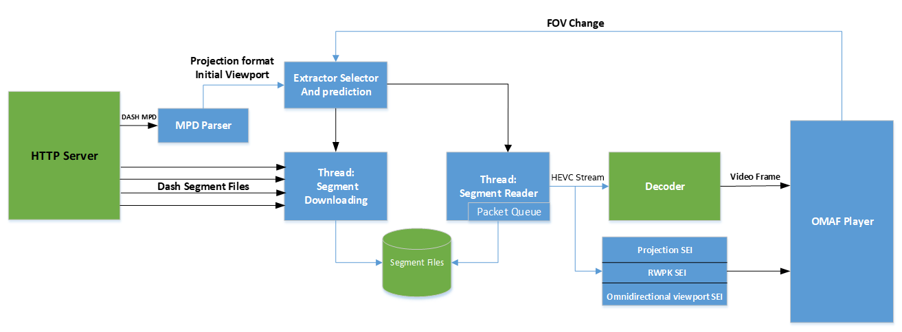
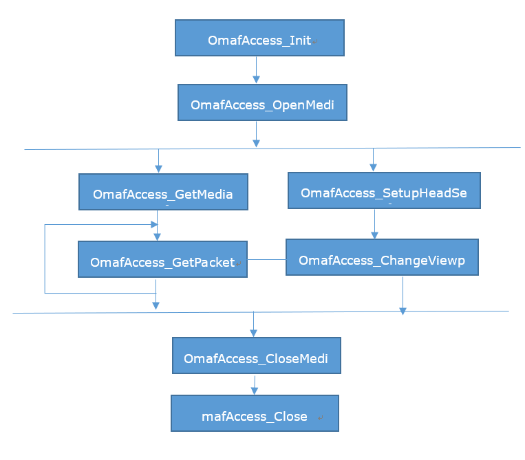

# Immersive Video Delivery Dash Access Library

## Introduction 
Dash Access library is a client library for accessing the tiled-based viewport-dependent media content, reconstruct video stream based on OMAF specification. The function of the library includes:
- OMAF-Compliant MPD file parser
- Tile-based MP4 segmentation downloading and parsing
- Viewport-based Tile-set Selection
- OMAF-Compliant Metadata parsing
- Tiles stitching to reconstruct multiple video streams based on viewport when there is no extractor track enabled (later binding mode).
- Support tiles stitched video streams split based on maximum decodable picture width and height limitation (later binding mode).
- Support equirectangular projected media content in both extractor track mode and later binding mode.
- Support cube-map projected media content in both extractor track mode and later binding mode.
- Support AAC audio DASH MPD file parsing, segments downloading and parsing
- Support planar projected media content in later binding mode.

Linux-based version and Android-based version of the library are both supported.

## API Call Sequence

Dash Access Library provides C APIs for user; the call sequence is as follows:

Before calling any other APIs in the library, you should call OmafAccess_Init to get the Handler for further usage. 
- OmafAccess_OpenMedia is used to open a url which is compliant to OMAF DASH specification, and the MPD file will be downloaded and parsed. Then you can use OmafAccess_GetMediaInfo to get relative A/V information in the stream.
- OmafAccess_SetupHeadSetInfo is used to set the initial head position of the user, and it will be used to select the initial viewport information and relative tile-set; 
- OmafAccess_GetPacket is the function used to get well-aggregated video streams based on viewport and maximum decodable picture width and height (later binding mode), and can be decoded by general decoder for rendering; with the API, you can also get the video stream RWPK (Region-Wise Packing) information for each output video stream, the total number of output video streams and informaiton of each output video stream, like resolution. With/without the same thread, you can call OmafAccess_ChangeViewport to change viewport, the function will re-choose the Tile Set based on input pose Information, and it will decide what packed content will be get in next segment.
- After all media is played out, you can call OmafAccess_CloseMedia and OmafAccess_Close to end the using of the library.
