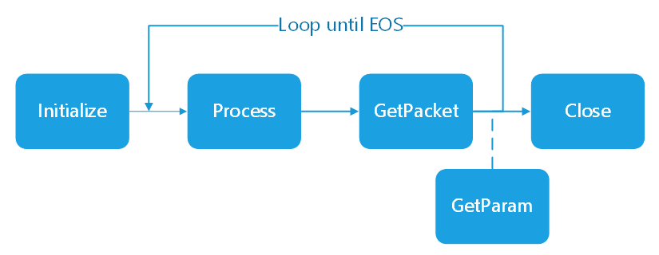

# Immersive Video Delivery Distribute Encoder

The library implemented real-time high-resolution stream transcoding with distributed system, distributed system means one main schedule machine and multiple execute machines here, where the schedule machine dispatches heavy tasks to other machines to fully take advantage of capability of multiple machines.

Using RPC for the scheduler between schedule machine and execute machines, RPC means Remote Procedure Call, it’s a system consist of client and server, the client is the one who send request and the server is the one who is keep listening for requests and then executes requests.

The main schedule machine can be took as transcoder, encoded bitstream or raw stream (e.g. YUV) is the input, and encoded bitstream with tiles is the output. It supports encoded and raw stream two kinds of input, the encoded stream should be AVC or HEVC elementary stream, muxed bitstream input is not supported.

Main encoder has a worker manager to manage all the workers, the worker can be local machine or remote machine, and the IP address of local machine is 127.0.0.1. Worker manager has resource manager and task dispatcher, resource manager get capabilities of all workers and report to worker manager, task dispatcher dispatches tasks with designated rules (according to resource status or average). 


All the worker information including IP address, port and specific socket limitation can be defined in config file, here is the example:
- ip 127.0.0.1 port 9090 numa 1 (*local worker with port 9090, limited on CPU socket 0*)
- ip 10.67.115.46 port 9089 numa 2 (*remote worker with port 9089. Limited on CPU socket 1*)

There is a ffmpeg plugin to integrate distribute encoder library into ffmpeg command. The follows is the sample command used to do encode with distribute encoder library:

Example command line (as ffmpeg plugin):
**BS INPUT**:
- HEVC bitstream input(demuxed) + -c:v hevcbypassdec + -input_type 0 + input_codec 0
```bash
  *./ffmpeg -stream_loop -1 -W 3840 -H 1920 -c:v hevcbypassdec -i vr360.265 -c:v distributed_encoder -tile_row 2 -tile_column 3 -config_file config_file.txt -input_type 0 -input_codec 0 -vframes 1000 -g 6 -y test.265*
``` 
- AVC bitstream input(demuxed) + -c:v h264bypassdec + -input_type 0 + input_codec 1
```bash  
  *./ffmpeg -stream_loop -1 -W 3840 -H 1920 -c:v hevcbypassdec -i vr360.264 -c:v distributed_encoder -tile_row 2 -tile_column 3 -config_file config_file.txt -input_type 0 -input_codec 1 -vframes 1000 -g 6 -y test.265*
```
**YUV INPUT**:
- Any YUV input + -input_type 1
```bash  
  *./ffmpeg -stream_loop -1 -f rawvideo -video_size 3840x1920 -i vr360.yuv -c:v distributed_encoder -tile_row 2 -tile_column 3 -config_file config_file.txt -input_type 1 -vframes 1000 -g 6 -y test.265*
```
 
