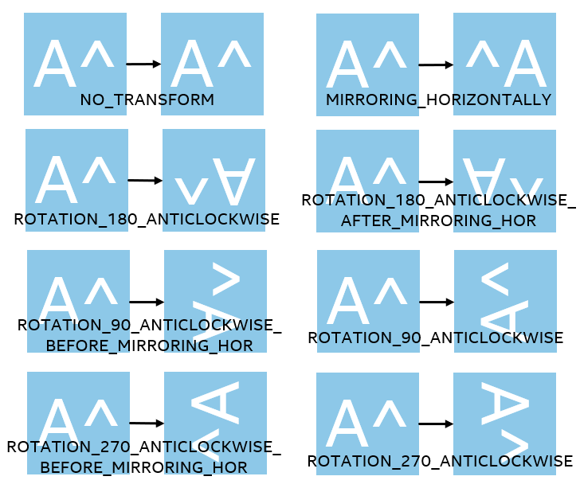

# Immersive Video Delivery FFmpeg Plugins

## Introduction
- There are 3 FFmpeg plugins provided in the project: OMAF Packing, Distribute Encoder, and OMAF Dash Access. The implementations of plugins provide a quick way to build tiled-based 360 Video delivery pipeline from server transcoding to client playback based on the libraries built from the project. At the same time, the plugins are also the sample code indicating how to use relative libraries.
- To build a E2E 360 Video delivery pipeline, the FFmpeg plugins provide key functions and relative build-in or external modules of FFmpeg are also needed to get the best performance, such as HEVC/H264 decoder, scaling filter, demuxer and so on. To achieve the best performance, parameters tuning of each component is necessary.
- The FFmpeg patches based on specific code base are provided in the project to enable these plugins.
- The sample command for "decoder + encoder + packing":
```bash
  ffmpeg -i [file] -input_type 1 \
      -c:v:0 distributed_encoder -s:0 3840x1920 -tile_row:0 6 -tile_column:0 10 \
      -config_file:0 config_high.xml -g:0 15 -b:0 30M -map 0:v \
      -c:v:1 distributed_encoder -s:1 1024x640 -tile_row:1 2 -tile_column:1 4 \
      -config_file:1 config_low.xml -g:1 15 -b:1 5M -map 0:v \
      -f omaf_packing -is_live 0 -split_tile 1 -seg_duration 1 -window_size 20 -extra_window_size 30 \
      -base_url http://[server ip]/OMAFStatic_4k/ -out_name Test /usr/local/nginx/html/OMAFStatic_4k/
```

## OMAF Packing Plugin
OMAF Packing Plugin is a multiplexer in the pipeline to use OMAF packing library to packing input bitstream to generate OMAF-compliant DASH content. Plugin name is "omaf_packing", options available for this plugin are listed as below:

| **Parameters** | **Descriptions** | **Type** | **Default Value** | **Range** | **Must-Have** |
| --- | --- | --- | --- | --- | --- |
| packing_proj_type | Input source projection type | string | "ERP" | "ERP" or "Cubemap" | NO |
| cubemap_face_file | Configure input cubemap face relation to face layout defined in OMAF for cube-3x2 | string | N/A | N/A | NO |
| viewport_w | Set viewport width | int | 1024 | N/A | NO |
| viewport_h | Set viewport height | int | 1024 | N/A | NO |
| viewport_yaw | Set viewport yaw angle, which is the angle around y axis | float | 90 | [0.0, 180.0] | NO |
| viewport_pitch | Set viewport pitch angle, which is the angle around x axis | float | 0 | [0.0, 100.0] | NO |
| viewport_fov_hor | Set horizontal angle of field of view (FOV) | float | 80 | [0.0, 180.0] | NO |
| viewport_fov_ver | Set vertical angle of field of view (FOV) | float | 90 | [0.0, 100.0] | NO |
| window_size | Number of segments kept in the manifest | int | 5 | N/A | NO |
| extra_window_size | Number of segments kept outside of the manifest before removing from disk | int | 15 | N/A | NO |
| split_tile | Need split the stream to tiles if input is tile-based hevc stream | int | 0 | 0, 1 | NO |
| seg_duration | Segment duration (in u seconds, fractional value can be set) | int | 5000000 | N/A | NO |
| remove_at_exit | Remove all segments when finished | int | 0 | 0, 1 | NO |
| use_template | Use SegmentTemplate instead of SegmentList | bool | 0 | 0, 1 | NO |
| use_timeline | Use SegmentTimeline in SegmentTemplate | int | 0 | 0, 1 | NO |
| utc_timing_url | URL of the page that will return the UTC timestamp in ISO format | string | N/A | N/A | NO |
| is_live | Enable/Disable streaming mode of output. Each frame will be moof fragment | bool | 0 | 0, 1 | YES |
| base_url | MPD BaseURL, it can be the the url of generated segmentatio and MPD files | string | N/A | N/A | YES |
| out_name | Name prefix for all dash output files | string | N/A | "dash-stream" | NO |
| need_buffered_frames | Needed buffered frames number before packing starts | int | 15 | N/A | NO |
| extractors_per_thread | Extractor tracks per segmentation thread | int | 0 | N/A | NO |
| has_extractor | Enable/Disable OMAF extractor tracks| int | 1 | 0, 1 | NO |
| packing_plugin_path | OMAF Packing plugin path | string | N/A | "/usr/local/lib" | NO |
| packing_plugin_name | OMAF Packing plugin name | string | N/A | "HighResPlusFullLowResPacking" | NO |
| video_plugin_path | Video stream process plugin path | string | N/A | "/usr/local/lib" | NO |
| video_plugin_name | Video stream process plugin name | string | N/A | "HevcVideoStreamProcess" | NO |
| audio_plugin_path | Audio stream process plugin path | string | N/A | "null" | NO |
| audio_plugin_name | Audio stream process plugin name | string | N/A | "null" | NO |
| fixed_extractors_res | Whether extractor track needs the fixed resolution | bool | 0 | 0, 1 | NO |
| need_external_log | Whether external log callback is needed | bool | 0 | 0, 1 | NO |
| min_log_level | Minimal log level of output [0: INFO, 1: WARNING, 2: ERROR, 3: FATAL] | int | 2 | [0, 3] | NO |

Sample command line for cube-map projected input source is as follows:
``` bash
    numactl -c 1 ./ffmpeg -stream_loop -1 -i [file] -input_type 1 -proj_type Cubemap -rc 1 \
        -c:v:0 distributed_encoder -s:0 5760x3840 -tile_row:0 6 -tile_column:0 9 \
        -config_file:0 config_high.xml -la_depth:0 25 -r:0 25 -g:0 25 -b:0 80M -map 0:v \
        -c:v:1 distributed_encoder -s:1 960x640 -sws_flags neighbor -tile_row:1 2 -tile_column:1 3 \
        -config_file:1 config_low.xml -la_depth:1 25 -r:1 25 -g:1 25 -b:1 1500K -map 0:v \
        -vframes 3000 -f omaf_packing -packing_proj_type Cubemap -cubemap_face_file 6kcube_face_info.txt \
        -is_live 0 -split_tile 1 -seg_duration 1 -has_extractor 0 \
        -base_url http://[server ip]:8080/8kcubevod/ -out_name Test /usr/local/nginx/html/8kcubevod/
```
The file "6kcube_face_info.txt" is to configure input cube-map face relation to face layout defined in OMAF spec for cube-3x2.
The content of "6kcube_face_info.txt" is as follows:
```
NY NO_TRANSFORM
PY NO_TRANSFORM
PZ NO_TRANSFORM
NZ NO_TRANSFORM
PX NO_TRANSFORM
NX NO_TRANSFORM
```
NY/PY/PZ/NZ/PX/NX mean corresponding faces location in face layout defined in OMAF spec for cube-3x2 of faces in input cube-map projected source in raster scanning sequence.
NO_TRANSFORM means there is no additional transform of input faces, like rotation. For more transform type definitions, please refer to following picture, note that this feature is only supported for cube-3x2:


## Distribute Encoder Plugin
Distribute Encoder Plugin is using DistributeEncoder library to do SVT-based HEVC Encoding. Plugin name is "distributed_encoder", options available for this plugin are listed as below:

First, `config_file` is a must-have parameter containing "ip" and "port" pair, corresponding to IP address and the port of object machine to deploy sub-encoder. Replace IP address like "127.0.0.1" with "local" to start local mode, deploy sub-encoder on host machine directly. And "numa" node is required in 8K input for better FPS performance.

| **Parameters** | **Descriptions** | **Type** | **Default Value** | **Range** | **Must-Have** |
| --- | --- | --- | --- | --- | --- |
| config_file | Configure xml file path for workers information | string | N/A | N/A | YES |
| proj_type | Input source projection type, ERP or Cubemap | string | "ERP" | "ERP" or "Cubemap" | NO |
| input_type | Input stream type, 0 - encoded, 1 - raw | int | 0 | 0, 1 | NO |
| input_codec | Input bitstream type, only work when input type is 0-encoded, 1-yuv | int | 0 | 0, 1 | NO |
| vui | Enable vui info | int | 0 | 0, 1 | NO |
| aud | Include AUD | int | 0 | 0, 1 | NO |
| hielevel | Hierarchical prediction levels setting [0: flat, 1: 2level, 2: 3level, 3: 4level] | int | 3 | [0, 4] | NO |
| la_depth | Look ahead distance | int | -1 | [-1, 256] | NO |
| preset | Encoding preset (e,g, for subjective quality tuning mode and >=4k resolution), [0, 10] (for >= 1080p resolution), [0, 9] (for all resolution and modes) | int | 9 | [0, 12] | NO |
| profile | Profile setting, Main Still Picture Profile not supported | int | 2 | [1, 4] | NO |
| tier | Set tier (general_tier_flag), 0: main, 1: high| int | 0 | 0, 1 | NO |
| level | Set level (level_idc) | int | 0 | [0, 255] | NO |
| rc | Bit rate control mode, 0:cqp, 1:vbr | int | 0 | 0, 1 | NO |
| qp | QP value for intra frames | int | 32 | 0, 51 | NO |
| sc_detection | Scene change detection | int | 0 | 0, 1 | NO |
| tune | Quality tuning mode, 0: sq, 1:oq, 2:vmaf | int | 1 | [0, 2] | NO |
| bl_mode | Random Access Prediction Structure type setting | int | 0 | 0, 1 | NO |
| hdr | High dynamic range input | int | 0 | 0, 1 | NO |
| asm_type | Assembly instruction set type [0: C Only, 1: Auto] | int | 0 | 0, 1 | NO |
| tile_column | Tile column count number | int | 1 | [1, 20] | NO |
| tile_row | Tile row count number | int | 1 | [1, 20] | NO |
| in_parallel | Multiple encoders running in parallel [0: Off, 1: On] | int | 0 | 0,1 | NO |
| need_external_log | Whether external log callback is needed | bool | 0 | 0, 1 | NO |
| min_log_level | Minimal log level of output [0: INFO, 1: WARNING, 2: ERROR, 3: FATAL] | int | 2 | [0, 3] | NO |

## OMAF Dash Access Plugin
OMAF Dash Access Plugin is a FFmpeg demux used to access OMAF Dash Content by DashAccessLibrary. The demux name is "tiled_dash_demuxer". it is used to playback the content for test purpose. The options available for this plugin are listed as below:

| **Parameters** | **Descriptions** | **Type** | **Default Value** | **Range** | **Must-Have** |
| --- | --- | --- | --- | --- | --- |
| allowed_extensions | List of file extensions that dash is allowed to access | string | "mpd" | N/A | YES |
| cache_path | The specific path of cache folder | string | "/home" | N/A | YES |
| enable_extractor | Whether to enable extractor track in OMAF Dash Access engine  | int | 1 | 0, 1 | YES |

Sample Command:
```bash
  ffplay -allowed_extensions mpd -enable_extractor 0 [mpd url]
```
