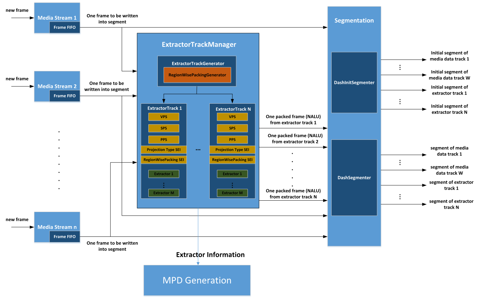

# Immersive Video Delivery OMAF Packing

## Introduction
OMAF Packing Library will generate OMAF compliant DASH (dynamic adaptive streaming over HTTP) files, that is MPD (media presentation description) file and mp4 segment files.
The diagram of OMAF Packing library is depicted as follows:

The main OMAF compliant features in this library are listed as follows:
- Support OMAF viewport-dependent baseline presentation profile and HEVC-based viewport-dependent OMAF video profile.
- Signal omnidirectional video projection type information in MPD file by adding an EssentialProperty element with a @schemeIdUri attribute equal to “urn:mpeg:mpegI:omaf:2017:pf” and in ISOBMFF segment files by adding a new box ‘povd’.
- Signal sub-picture region wise packing information in MPD file by adding an EssentialProperty element with a @schemeIdUri attribute equal to "urn:mpeg:mpegI:omaf:2017:rwpk" and in ISOBMFF segment files by adding a new box ‘rwpk’.
- Signal sub-picture content coverage information in MPD file by adding a SupplementalProperty element with a @schemeIdUri attribute equal to “urn:mpeg:mpegI:omaf:2017:cc” and in ISOBMFF segment files by adding a new box ‘covi’.
- Support DASH track based on HEVC tile.
- Support OMAF compliant extractor track to organize relative HEVC tiles from high quality bitstream and low quality bitstream to construct sub-picture which will be played based on user’s orientation.
- Support both static mode and dynamic (live) mode DASH.
- Support option to appoint whether OMAF compliant extractor track will be generated, that is, extractor track mode or later binding mode.
- Support customized plugin to generate sub-picture region wise packing information when extractor track will be generated.
- Support equirectangular projection format in both extractor track mode and later binding mode.
- Support cube-map projection format in both extractor track mode and later binding mode.
  When the input source is cube-map projected, input cube-map face layout and corresponding transform type need to be specified.
  Firstly, specify the face index for each face which is defined in OMAF spec for cube-3x2.
  PY 0
  PX 1
  NY 2
  NZ 3
  NX 4
  PZ 5
  Secondly, specify the transform type of the input face. The transform type is depicted in below image:
  
  Now only cube-3x2 is supported.
- Support both fixed sub-picture resolution and dynamic sub-picture resolution in extractor track.
  When fixed sub-picture resolution is required, each extractor track has the same sub-picture resolution, and it is the resolution from the largest selected tiles number.
  When dynamic sub-picture resolution is required, the resolution of tiles stitched picture in extractor track comes from the actual selected tiles number.
- Support AAC audio DASH track.
- Support planar projection format in later binding mode.
  When the input sources come from planar projectin, the main Adaptation Set item in MPD will give the all video information, like resolution and tile slize.

## API Call Sequence
- Call VROmafPackingInit API to create and initialize VROmafPacking library instance
- Call VROmafPackingWriteSegment API to write one frame from one video to segment file. This API is called one time one frame.
- Call VROmafPackingEndStreams API to stop segmentation process.
- Call VROmafPackingClose API to free VROmafPacking library related resource.

Input Bitstream Requirements
There are below requirements about input video bitstream to VROmafPacking library:
- The input video bitstream must be HEVC compliant stream. That is, bitstream must conform with HEVC syntax and semantics.
- The first 4 NAL units in video bitstream must be VPS, SPS, PPS and Projection type SEI. And the Projection type SEI payload type must be 150 or 151, which are for equirectangular projection type and cube-map projection type respectively.
- When the video source is from planar projection, no Projection type SEI is needed. That is, before the tile NAL unit, the first 3 NAL units in video bitstream must be VPS, SPS and PPS.
- Tiles encoding must be enabled in input video stream and tiles split must be uniform, that is, syntax element ‘tiles_enabled_flag’ in PPS is 1 and ‘uniform_spacing_flag’ in PPS is also 1. In addition, MCTS (motion-constrained tile set) also needs to be enabled for packed picture quality. When this feature is enabled, CU at the edge of tile will not use padded pixels out of tile itself for motion estimation, that is, motion vectors for these CUs only point to pixels or sub-pixels inside tile. Then tiles will not depend on other tiles in encoding and decoding at all. There will be no mismatch between encoding and decoding. So, artifacts, like mosaics, will not appear in packed picture.
- The GOP size of input video stream is suggested to correspond to frame rate to make sure the first frame in segment file is I frame. GOP size could equal to one reasonable divisor of frame rate. For example, if frame rate is 30, then GOP size could be 15 or 30.
- If the video sources are from equirectangular projection type or cube-map projection type, the number of input video streams can only be 2.
- If the video sources are from planar projection type, the number of input video streams can be more than 2.
