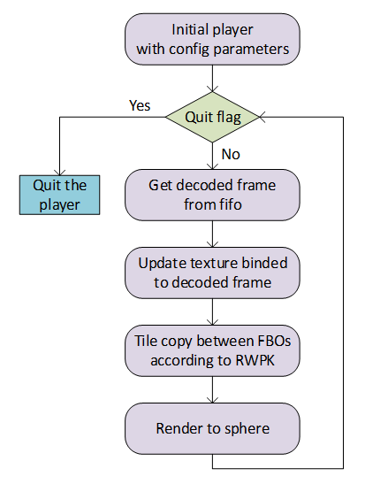
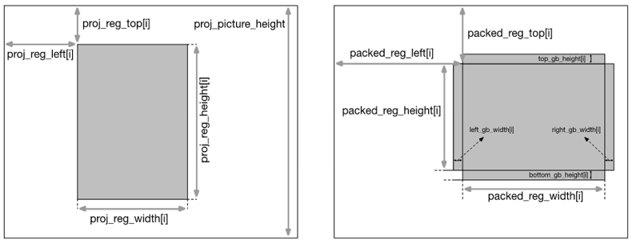
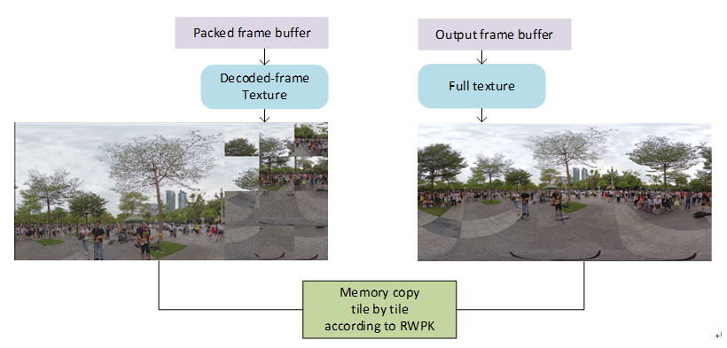
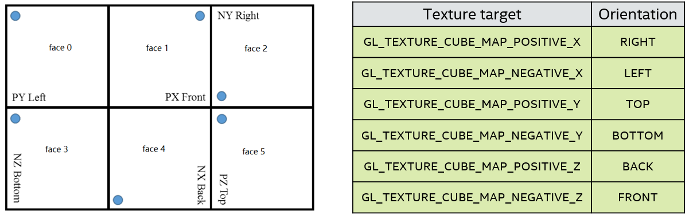
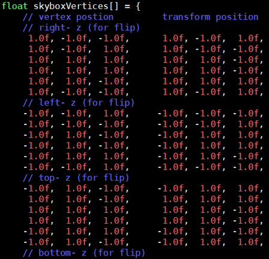

# Immersive Video Delivery Reference Player

## Introduction
The reference 360 player is used to play the mixed-resolution stream video transmitted from the server. Linux and Android platform are both supported.

Based on the current viewport, corresponding regions are rendered on the window. The workflow is as follows:

 
The 360 player supports streams in both Equirectangle and Cubemap geometry. In Linux player, after getting encoded packet from Dash Access Library, FFmpeg software decoder is used to decode frames. Decoded frame is bind to a 2D texture and the texture would be updated every frame. And then according to Region-wise Packing information, there exists tiles copy between packed frame buffer and output frame buffer. The last step is to render the output frame buffer to sphere or skybox.

In Android player, MediaCodec decoder is ultilized to decode packets from Dash Access Library and deliver the output to decoded surfaces. And then, Draw tile by tile from decoded surfaces to display surface according to Region-wise Packing information. The last step is to render the output frame buffer to sphere or skybox.

Except for 3D projection media contents, planar format is supported in late binding mode.

Extractor-track and later-binding strategy are both supported. Thus, there may be multiple videos of different quality rankings in one input stream. Decoder manager is created to support multi-decoder process. Decoders will be destroyed, restarted or reset if the number of videos, resolution or codec format changes.

The very important step in render is how to correctly remap the mixed-resolution decoded frame to the display texture in space. Region-wise Packing (RWPK) information would be obtained from Omaf Dash Access library together with an encoded packet, which represents the mapping space relationship between decoded frame and sphere texture. The RWPK schematic diagram is shown as follows:

In the specific implementation process, the texture that decoded frame is bind and full texture both are attached to the corresponding frame buffer object. The following figure shows the remapping operation. It is a tile copy process which can be implemented in GPU memory using OpenGL APIs.

 

### Rotation in render
As shown in following figure, there exist different face descriptions in OMAF spec and OpenGL, so it’s required to align them.
In CubeMapRenderTarget class, mOMAF2GLFaceIDMap is a map that defines the projection relationship between them.

Second, in Create function in CubeMapMesh class, skyboxVertices is defined to describe the six face vertices without transform type information, which is shown in following figure.

And in Bind function in CubeMapMesh class, the vertices in each face would be transformed according to m_transformType data. The transform action here is reverse to the action described in m_transformType, which is to rotate the scene back to NO_TRANSFORM.

## Configuration
The configuration file, config.xml, is used to config parameters for 360 linux player, as shown in the following Table:

| **Parameters** | **Descriptions** | **examples** |
| --- | --- | --- |
| windowWidth | The width of render window | 960 for 4k, 1920 for 8k |
| windowHeight | The height of render window  | 960 for 4k, 1920 for 8k  |
| url | The resource URL path | Remote URL |
| sourceType | Source type | 0 is for Dash Source |
| enableExtractor | extractor track path or later binding path | 1 is for extractor track and 0 is for later binding |
| StreamDumpedOption | dump packet streams or not | 0 for false, 1 for true |
| viewportHFOV | Viewport horizon FOV degree | 80 |
| viewportVFOV | Viewport vertical FOV degree | 80 |
| viewportWidth | Viewport width | 960 for 4k, 1920 for 8k |
| viewportHeight | Viewport height | 960 for 4k, 1920 for 8k |
| cachePath | Cache path | /tmp/cache |
| minLogLevel | min log level | INFO / WARNING / ERROR / FATAL |
| maxVideoDecodeWidth | max video decoded width | decoded width that is supported |
| maxVideoDecodeHeight | max video decoded height | decoded height that is supported |
| predict | viewport prediction plugin | 0 is disable and 1 is enable |
| intimeviewportupdate | support catch up path | 0 is disable and 1 is enable |
| responseTimesInOneSeg| max catch up streams num in one segment duration | 1 or 2 |
| maxCatchupWidth | max width of catch up streams | lower than 4k |
| maxCatchupHeight | max height of catch up streams | lower than 4k |
| PathOf360SCVPPlugins | path of 360SCVP plugins | needed for planar format rendering |
