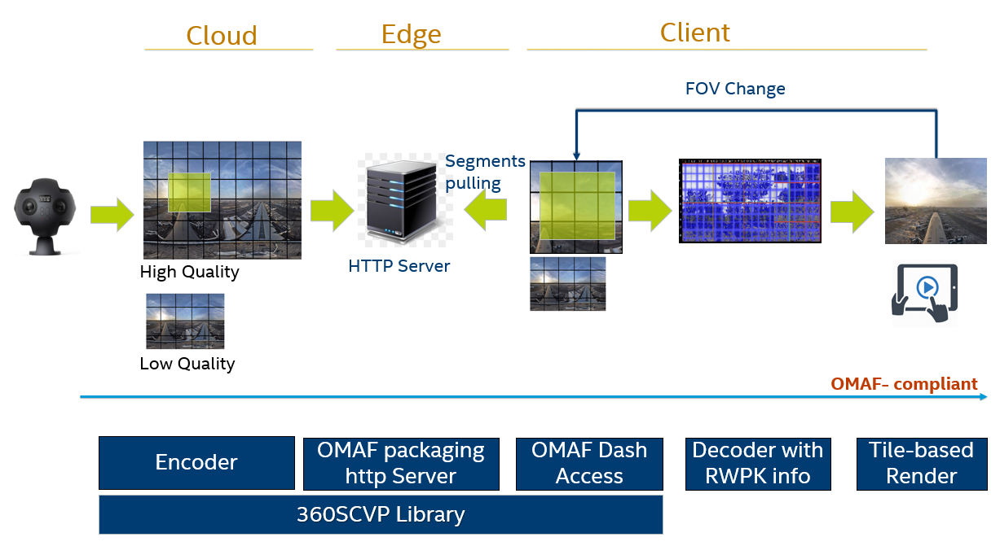

# Immersive Video Delivery Getting Started Guide

   * [Immersive Video Delivery Getting Started Guide](#immersive-video-delivery-getting-started-guide)
   * [Introduction](#introduction)
   * [Prerequisites](#prerequisites)
   * [Build](#build)
      * [Build Server Components](#build-server-preresuisties)
      * [Build Client Components](#build-client-preresuisties)
   * [Quick Run](#quick-run)

This document describes how to build OMAF-Compliant Immersive Video Delivery components and how to run sample tests.

Intel Immersive Video Delivery solution provides the basic components for OMAF-Compliant Tiled 360 Video Delivery, including MCTS-based HEVC transcoding, OMAF-compliant streaming packing, client OMAF dash access library, and FFMPEG plugins for quick trial for these components to setup E2E OMAF-Compliant 360 video streaming. Both VOD and Live streaming are supported by the solution. The solution only supports one video processing mode which is not in ISO/IEC 23090-2 Annex D; also provides an common interface for developer to create new video processing mode.

# Introduction
Intel VCD Immersive Video Delivery solution provides basic components for OMAF-Compliant Tiled 360 Video Delivery, including MCTS-based HEVC transcoding, OMAF-compliant streaming packing, client OMAF dash access library; and FFMPEG plugins for quick trial for these components to setup E2E OMAF-Compliant 360 video streaming.


# Prerequisites

[Build](#Build) process and [Quick Run](#Quick Run) are verified on *CentOS 7.6(server)* and *Ubuntu 18.04(client)*

To build the whole solution, there are some prerequisites must be ready.
```bash
gcc >= 6.3.1
g++ >= 6.3.1
cmake >= 3.12.4
```

# Build
## Build Server Components
```bash
# Make sure using gcc >= 6.3.1
git clone https://github.com/OpenVisualCloud/Immersive-Video-Sample.git
cd Immersive-Video-Sample/src/external
./build.sh server y   # Install dependency before the first build
# ./build.sh server n # Build without dependency installation
```

## Build Client Components
```bash
# Make sure using gcc >= 6.3.1
git clone https://github.com/OpenVisualCloud/Immersive-Video-Sample.git
cd Immersive-Video-Sample/src/external
./build.sh client y   # Install dependency before the first build
# ./build.sh client n # Build without dependency installation
```

# Quick Run
To run sample tests, Ngnix server have to be installed on server side, please refer to the example in [ngnix setup](ngnix_setup.md).
For details of parameters of FFmpeg plugins, please refer to the [FFmpeg usage doc](Immersive_Video_Delivery_FFmpeg_usage.md).

## Server Side

Set up RSA if HTTPS is used.
```bash
sudo ssh-keygen -t rsa
sudo ssh-copy-id root@<server ip>
```

### Live Streaming
- Test Command for 4K Video:
```bash
  cd /path/to/Immersive-Video-Sample/src/build/server/ffmpeg
  ffmpeg -re -i [rtmp://localhost/demo/1.flv] -input_type 1 -rc 1 \
      -c:v:0 distributed_encoder -s:0 3840x1920 -tile_row:0 6 -tile_column:0 10 \
      -config_file:0 config_high.xml -g:0 15 -b:0 30M -map 0:v \
      -c:v:1 distributed_encoder -s:1 1024x640 -sws_flags neighbor -tile_row:1 2 -tile_column:1 4 \
      -config_file:1 config_low.xml -g:1 15 -b:1 5M -map 0:v \
      -f omaf_packing -is_live 1 -split_tile 1 -seg_duration 1 -window_size 20 -extra_window_size 30 \
      -base_url http://[ServerIP]/OMAFLive_4k/ -out_name Test /usr/local/nginx/html/OMAFLive_4k/
```

- Test Command for 8K Video:
```bash
  cd /path/to/Immersive-Video-Sample/src/build/server/ffmpeg
  numactl -c 1 ffmpeg -re -i [rtmp://192.168.1.10:1935/live/video] -input_type 1 -rc 1 \
      -c:v:0 distributed_encoder -s:0 7680x3840 -g:0 25 -tile_row:0 6 -tile_column:0 12 \
      -la_depth:0 0 -config_file:0 config_high.xml -b:0 50M -map 0:v \
      -c:v:1 distributed_encoder -s:1 1280x1280 -sws_flags neighbor -g:1 25 -tile_row:1 2 -tile_column:1 2 \
      -la_depth:1 0 -config_file:1 config_low.xml -b:1 2M -map 0:v \
      -f omaf_packing -is_live 1 -split_tile 1 -seg_duration 1 -extractors_per_thread 4 \
      -base_url http://[ServerIP]/OMAFLive_8k/ -out_name Test /usr/local/nginx/html/OMAFLive_8k/
```

### Tiled Content Generation for VOD

- Test Command for 4K Video:
```bash
  cd /path/to/Immersive-Video-Sample/src/build/server/ffmpeg
  ffmpeg -i [file] -input_type 1 -rc 1 \
      -c:v:0 distributed_encoder -s:0 3840x1920 -tile_row:0 6 -tile_column:0 10 \
      -config_file:0 config_high.xml -g:0 15 -b:0 30M -map 0:v \
      -c:v:1 distributed_encoder -s:1 1024x640 -sws_flags neighbor -tile_row:1 2 -tile_column:1 4 \
      -config_file:1 config_low.xml -g:1 15 -b:1 5M -map 0:v \
      -f omaf_packing -is_live 0 -split_tile 1 -seg_duration 1 -window_size 20 -extra_window_size 30 \
      -base_url http://[ServerIP]]/OMAFStatic_4k/ -out_name Test /usr/local/nginx/html/OMAFStatic_4k/
```

- Test Command for 8K Video:
```bash
  cd /path/to/Immersive-Video-Sample/src/build/server/ffmpeg
  numactl -c 1 ffmpeg -i [file] -input_type 1 -rc 1 \
      -c:v:0 distributed_encoder -s:0 7680x3840 -g:0 25 -tile_row:0 6 -tile_column:0 12 \
      -la_depth:0 0 -config_file:0 config_high.xml -b:0 50M -map 0:v \
      -c:v:1 distributed_encoder -s:1 1280x1280 -sws_flags neighbor -g:1 25 -tile_row:1 2 -tile_column:1 2 \
      -la_depth:1 0 -config_file:1 config_low.xml -b:1 2M -map 0:v \
      -f omaf_packing -is_live 0 -split_tile 1 -seg_duration 1 -extractors_per_thread 4 \
      -base_url http://[ServerIP]/OMAFStatic_8k/ -out_name Test /usr/local/nginx/html/OMAFStatic_8k/
```

## Client Side

Modify the config.xml; please refer to [Reference Player Configuration](Immersive_Video_Delivery_RefPlayer.md) for detailed information.
```bash
cd /path/to/Immersive-Video-Sample/src/build/client/player
export LD_LIBRARY_PATH=/usr/local/lib/:$LD_LIBRARY_PATH
vim config.xml  # Set up configuration, details in following table
./render        # Located at the same path with config.xml above
```
**Config.xml**

| **Parameters** | **Descriptions** | **examples** |
| --- | --- | --- |
| windowWidth | The width of render window | 960 for 4k, 1920 for 8k |
| windowHeight | The height of render window  | 960 for 4k, 1920 for 8k  |
| url | The resource URL path | Remote URL |
| sourceType | Source type | 0 is for Dash Source |
| enableExtractor | extractor track path or later binding path | 1 is for extractor track and 0 is for later binding |
| StreamDumpedOption | dump packet streams or not | 0 for false, 1 for true |
| viewportHFOV | Viewport horizon FOV degree | 80 |
| viewportVFOV | Viewport vertical FOV degree | 80 |
| viewportWidth | Viewport width | 960 for 4k, 1920 for 8k |
| viewportHeight | Viewport height | 960 for 4k, 1920 for 8k |
| cachePath | Cache path | /tmp/cache |
| minLogLevel | min log level | INFO / WARNING / ERROR / FATAL |
| maxVideoDecodeWidth | max video decoded width | decoded width that is supported |
| maxVideoDecodeHeight | max video decoded height | decoded height that is supported |
| predict | viewport prediction plugin | 0 is disable and 1 is enable |
| PathOf360SCVPPlugins | path of 360SCVP plugins | needed for planar format rendering |

   - **Note** : So far, some parameters settings are limited. URL need to be a remote dash source URL, for example : `http://xxx.xxx.xxx.xxx:8080/OMAFLive_4k/Test.mpd`. The parameter `sourceType` must set to 0, which represents dash source. The parameter `decoderType` must set to 0, which stands for FFmpeg software decoder. The parameter `contextType` need to be 0, which represents glfw context. And `useDMABuffer` flag should be set to 0.
